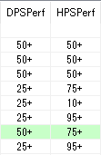

# ACT_quickFFlogsPerf

### logsの[統計情報](https://www.fflogs.com/zone/statistics/29/#class=Global&spec=Astrologian&boss=65&dataset=100&dpstype=pdps)をもとにPerfを表示するプラグイン
> ACTのDPS値はpDPS、logsはaDPS(pDPS-単体シナジー)です。   
> その点を理解した上で使用してください。


### AdvancedCombatTracker :



### OverlayPlugin / miniparse.html :

```json
{ text: "{DPSPerf}", width: "2em", align: "right", effect: logsTextEffect },

{ text: "{HPSPerf}", width: "2em", align: "right", effect: logsTextEffect },
```

```JavaScript
function logsTextEffect(cell) {
    var value = cell.innerText;
    if (value.startsWith("100")) {
        cell.style.color = "rgb(229,204,128)";
        return;
    }
    if (value.startsWith("99") || value.startsWith("95")) {
        cell.style.color = "rgb(255,128,0)";
        return;
    }
    if (value.startsWith("75")) {
        cell.style.color = "rgb(163,53,238)";
        return;
    }
    if (value.startsWith("50")) {
        cell.style.color = "rgb(0,112,255)";
        return;
    }
    if (value.startsWith("25")) {
        cell.style.color = "rgb(30,255,0)";
        return;
    }
    cell.style.color = "#666";
}
```

### ライセンス :

[The MIT License (MIT)](LICENSE)

### 使用ライブラリ :

> DynamicJson  
> ver 1.2.0.0 (May. 21th, 2010)
>
> licensed under Microsoft Public License(Ms-PL)  
> http://neue.cc/  
> https://dynamicjson.codeplex.com/
